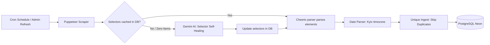

# 🏢 State Authorities App (MVP v1.0.0 Release)

Welcome to the **State Authorities App** monorepo. This platform serves as a modern, centralized directory and news aggregator for the State Authorities of Ukraine. It automates the scraping of government agency news feeds using an intelligent, self-healing crawler powered by LLM models, and exposes an administrative dashboard to manage public records.

---

## 🏗️ Monorepo Architecture Overview

This project is organized as a monorepo consisting of modular sub-applications and packages:

```text
state-authorities-app/
├── apps/
│   ├── api/            # Backend API (Node.js + Express.js + Prisma v7 + Winston)
│   └── web/            # Frontend Application (React + TypeScript + Vite)
├── packages/
│   ├── shared-types/   # Shared domain types
│   └── ui/             # Reusable layout components
├── docs/
│   └── architecture.md # Architectural sequence & process flowcharts (Mermaid.js)
├── CONTRIBUTING.md     # Branching, workflow, and conventional commits guide
└── README.md           # This file (Root documentation)
```

---

## ⚡ Core Components

### 🖥️ Frontend Web Application (`/apps/web`)

A responsive, high-performance web interface designed for catalog navigation, agency profile lookup, and secure administration.

- **Stack:** React (v19), TypeScript, Vite, React Router DOM, Vanilla CSS.
- **Key Features:**
  - Modern, Figma-compliant visual design system.
  - Stateful Directory with real-time fuzzy search, multi-category filters, sorting, and pagination.
  - Public Details pages containing official agency info and integrated live news feeds.
  - Protected Admin dashboard with secure cookie-based session authorization.
  - Full administrative CRUD operations (create/update/delete agency records).
  - Bulk data operations: Import classifications and export agency lists from/to CSV files.
- **Documentation:** Refer to the [Frontend README](apps/web/README.md) for local setup, build scripts, and directory structures.

### 📡 Backend API Service (`/apps/api`)

A robust, production-ready server providing data interfaces, authentication, and background job scheduling.

- **Stack:** Node.js, TypeScript, Express.js (Service-Repository pattern), Prisma ORM v7, PostgreSQL (Neon).
- **Key Features:**
  - Layered separation of concerns isolating data logic into repositories.
  - Swagger UI Interactive Documentation exposed at `/api-docs` (OpenAPI).
  - Winston and Morgan logging configured unbuffered for live Render.com telemetry.
  - Secure auth layer (Argon2 password hashing + HTTP-Only JWT cookies).
  - Integrated rate limiting, structured error handlers, and strict schema validation (Zod).
- **Documentation:** Refer to the [Backend README](apps/api/README.md) for API routes, payload formats, and environment configuration.

You can also download [Postman collection](docs/postman/) for better understanding how backend exactly works

---

## 🤖 NewsAI Scraper Core Engine

The platform includes an automated public news aggregation pipeline running inside the API service.



- **LLM Self-Healing Selector Generation:** If a target agency's website markup changes, the crawler detects zero-element scrapes and invokes Google Gemini API (`gemini-3.1-flash-lite`) to dynamically rebuild CSS selectors. It includes a **24-hour cooldown lock** to keep API usage cost-effective.
- **Timezone-Aware Parsing:** Normalizes Ukrainian dates strictly to the `Europe/Kyiv` timezone using `dayjs` rules, preventing server timezone drift issues.
- **Idempotent Unique Inserts:** Runs a pre-filtering set comparison to isolate new URLs before bulk inserting them with Prisma's `createMany(skipDuplicates: true)`.
- **Visual Workflows:** View interactive flowcharts for hot-cron reload and self-healing in [Architecture Diagrams](docs/architecture.md).

---

## 🚀 Quick Start Guide

### 1. Prerequisites

- **Node.js:** version 24+ recommended.
- **PostgreSQL Database:** Neon/Supabase instances recommended.
- **Google Gemini API Key:** Required for AI self-healing selectors.

### 2. Installation

Clone the repository and install dependencies inside each app package:

```bash
# Install backend dependencies
cd apps/api
npm install

# Install frontend dependencies
cd ../web
npm install
```

### 3. Running Services Locally

Start development environments:

```bash
# Run API (defaults to http://localhost:3000)
cd apps/api
npm run parse:kmu
npm run dev

# Run Web Client (defaults to http://localhost:5173)
cd apps/web
npm run dev
```

---

## 🛠️ Code Quality & Contribution

- **Linter & Formatter:** We utilize Biome(backend) and ESLint&Biome(frontend) for fast and clean linting/formatting checks.
  ```bash
  # Check formatting and lint rules across the workspace
  npm run lint
  ```
- **Branching & Commit Guidelines:** We use **Conventional Commits** (e.g., `feat:`, `fix:`, `chore:`, `docs:`) and target the `develop` branch for all active pull requests. Read [CONTRIBUTING.md](/CONTRIBUTING.md) for more details.

---

## 📦 Production Deployment

The project is optimized for deployment on **Render.com** (Free Tier compliant):

- **RAM Footprint Optimization:** The Node.js parser utilizes optimized heap limit hooks (`--max-old-space-size=384`) to operate safely under Render's 512MB memory boundary.
- **Environment Variables Checklist:** Ensure `DATABASE_URL`, `DIRECT_URL` `GEMINI_API_KEY`, `JWT_SECRET`, `NODE_ENV=production`, `VITE_API_URL` (for web client), and `FRONTEND_URL` (for backend CORS) are set.
