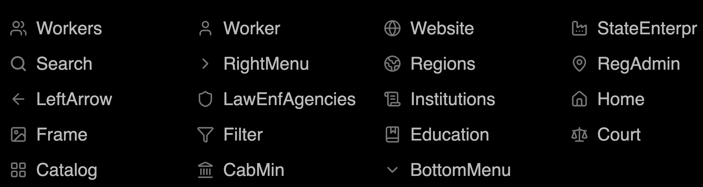

# Front-End Part

This folder contains the front-end application for the **State Authorities Catalog** project.

The front-end application is located in:

```text
/apps/web
```

This implementation currently contains the **basic layout** for the main user-facing pages based on the [Figma design](https://www.figma.com/design/G8QMwYywDHrtvZo1jtQms5/%D0%9A%D0%B0%D1%82%D0%B0%D0%BB%D0%BE%D0%B3-%D0%B4%D0%B5%D1%80%D0%B6%D0%B0%D0%B2%D0%BD%D0%B8%D1%85-%D1%83%D1%81%D1%82%D0%B0%D0%BD%D0%BE%D0%B2?node-id=0-1&p=f&t=jZvsylRtS6wF9vnc-0).

The goal of this stage is to prepare the structure of the front-end project so that the FE team can later split and implement features in parallel.

---

## Current Status

This front-end currently includes:

- Basic React + TypeScript application structure
- Page routing
- Static layout for 3 main pages
- Shared layout components
- SVG sprite icon usage
- Mock institution data
- Basic CSS structure

This is **not yet a fully functional product version**.  
Search, filters, pagination, real API integration, loading states, and error handling will be implemented later.

---

## Project Structure

```text
apps/web/
├── public/
│   └── icons.svg
├── src/
│   ├── components/
│   │   ├── layout/
│   │   │   ├── Header.tsx
│   │   │   ├── Header.module.css
│   │   │   ├── Footer.tsx
│   │   │   ├── Footer.module.css
│   │   │   └── PageContainer.tsx
│   │   ├── ui/
│   │   │   └── Icon.tsx
│   │   └── catalog/
│   │   │   ├── CatalogFilters.tsx
│   │   │   ├── CatalogToolbar.tsx
│   │   │   ├── InstitutionCard.tsx
│   │   │   ├── InstitutionList.tsx
│   │   │   └── Pagination.tsx
│   ├── data/
│   │   └── mockInstitutions.ts
│   ├── pages/
│   │   ├── HomePage.tsx
│   │   ├── CatalogPage.tsx
│   │   └── InstitutionPage.tsx
│   ├── routes/
│   │   └── AppRoutes.tsx
│   ├── styles/
│   │   └── global.css
│   ├── types/
│   │   └── institution.ts
│   ├── App.tsx
│   └── main.tsx
├── index.html
├── package.json
├── ...
└── vite.config.ts
```

---

## Pages

The application currently has 3 main pages:

```text
/                  Home page
/catalog           Catalog page
/institutions/:id  Institution details page
```

### 1. Home Page

File:

```text
src/pages/HomePage.tsx
```

Purpose:

The Home page is the landing page for the platform.

Layout sections:

- Hero section
- Search block
- Statistics cards
- Main institution categories
- About platform section

This page should be splitted into sections (since now it it just one file for the filling of the page) and later it will be connected to real statistics and real category data.

---

### 2. Catalog Page

File:

```text
src/pages/CatalogPage.tsx
```

Purpose:

The Catalog page displays a list of state institutions.

Layout sections:

- Page title
- Filter sidebar
- Search input
- Institution list
- Pagination placeholder

This page currently uses mock data.  
Later it should fetch real institutions from the backend API.

---

### 3. Institution Details Page

File:

```text
src/pages/InstitutionPage.tsx
```

Purpose:

The Institution page displays detailed information about one selected institution.

Layout sections:

- Back link
- Institution title
- Main information block
- Management block
- About institution section
- Related institutions section

The institution ID is taken from the route:

```text
/institutions/:id
```

Example:

```text
/institutions/1
```

In the page component, the ID can be accessed using `useParams` from `react-router-dom`.

Example:

```tsx
import { useParams } from "react-router-dom";

const { id } = useParams();
```

---

## Routing

Routing is handled with `react-router-dom`.

Routes are defined in:

```text
src/routes/AppRoutes.tsx
```

Example:

```tsx
import { Routes, Route } from "react-router-dom";
import { HomePage } from "../pages/HomePage";
import { CatalogPage } from "../pages/CatalogPage";
import { InstitutionPage } from "../pages/InstitutionPage";

export function AppRoutes() {
  return (
    <Routes>
      <Route path="/" element={<HomePage />} />
      <Route path="/catalog" element={<CatalogPage />} />
      <Route path="/institutions/:id" element={<InstitutionPage />} />
    </Routes>
  );
}
```

Routes are rendered inside:

```text
src/App.tsx
```

---

## Components

Components are stored in:

```text
src/components
```

The main component groups are:

```text
components/
├── layout/
├── ui/
└── catalog/
```

You can add there also "home" and "institutions"

### `components/layout`

Contains shared layout components used across the whole application.

Current components:

```text
Header.tsx
Header.module.css
Footer.tsx
Footer.module.css
PageContainer.tsx
```

#### Header

File:

```text
src/components/layout/Header.tsx
```

The header contains:

- Logo
- Link to Home page
- Link to Catalog page
- SVG icons from the sprite file

Header styles are stored separately in:

```text
src/components/layout/Header.module.css
```

#### Footer

File:

```text
src/components/layout/Footer.tsx
```

The footer contains:

- Logo
- General platform description
- Project information
- Contact placeholder

Footer styles are stored separately in:

```text
src/components/layout/Footer.module.css
```

#### PageContainer

File:

```text
src/components/layout/PageContainer.tsx
```

This component keeps page content aligned to the same maximum width.

Example:

```tsx
import type { ReactNode } from "react";

type PageContainerProps = {
  children: ReactNode;
};

export function PageContainer({ children }: PageContainerProps) {
  return <div className="page-container">{children}</div>;
}
```

---

### `components/ui`

Contains small reusable UI components.

Current component:

```text
Icon.tsx
```

The `Icon` component is used to render icons from the SVG sprite.

---

### `components/home (To be done)`

This folder is intended for Home page sections.

Suggested components:

```text
HeroSection.tsx
StatsSection.tsx
CategoriesSection.tsx
AboutSection.tsx
```

The Home page should later be refactored so that each large section is moved into its own component.

---

### `components/catalog`

This folder is intended for Catalog page components.

Suggested components:

```text
CatalogFilters.tsx
CatalogToolbar.tsx
InstitutionCard.tsx
InstitutionList.tsx
Pagination.tsx
```

Recommended responsibility:

- `CatalogFilters.tsx` — filter sidebar layout
- `CatalogToolbar.tsx` — search input and result count
- `InstitutionCard.tsx` — one institution card
- `InstitutionList.tsx` — list of institution cards
- `Pagination.tsx` — pagination layout

---

### `components/institution (To be done)`

This folder is intended for Institution details page components.

Suggested components:

```text
InstitutionHeader.tsx
InstitutionInfoCard.tsx
InstitutionManagementCard.tsx
RelatedInstitutions.tsx
```

Recommended responsibility:

- `InstitutionHeader.tsx` — page title and short description
- `InstitutionInfoCard.tsx` — main institution information
- `InstitutionManagementCard.tsx` — management/person in charge
- `RelatedInstitutions.tsx` — related or subordinate institutions

---

## Styling Rules

Global styles are stored in:

```text
src/styles/global.css
```

`global.css` should contain only styles that are shared across the whole application.

Examples of what belongs in `global.css`:

- CSS reset
- `body` styles
- Base typography
- Base link styles
- Base button/input font inheritance
- Shared utility classes
- `.page-container`
- `.section`
- `.card`

Component-specific styles should not be placed in `global.css`.

For example:

```text
Header styles  → Header.module.css
Footer styles  → Footer.module.css
Catalog styles → Catalog component modules
Home styles    → Home component modules
```

This keeps the styles easier to maintain and avoids conflicts between pages.

---

## CSS Modules

For component-specific styles, use CSS modules.

Example:

```text
Header.tsx
Header.module.css
```

Import styles like this:

```tsx
import styles from "./Header.module.css";
```

Use them like this:

```tsx
<header className={styles.siteHeader}>...</header>
```

This prevents class name conflicts and keeps each component's styles isolated.

---

## Icons

All SVG icons are stored in:

```text
/apps/web/public/icons.svg
```

This file is an SVG sprite. It contains multiple icons defined as SVG symbols.

Examples of available icons:

```text
Home
Catalog
Search
Filter
Institutions
Regions
Workers
Worker
Website
CabMin
Education
Court
LeftArrow
RightMenu
BottomMenu
Frame
```

The sprite file contains the following SVG icons:

```md

```

---

## How Icons Work

The `icons.svg` file contains SVG symbols like this:

```xml
<symbol id="Home" viewBox="0 0 28 28">
  ...
</symbol>
```

To use an icon, reference its `id` through the reusable `Icon` component.

The shared icon component is located in:

```text
src/components/ui/Icon.tsx
```

Example:

```tsx
type IconProps = {
  name: string;
  size?: number;
  className?: string;
};

export function Icon({ name, size = 20, className }: IconProps) {
  return (
    <svg className={className} width={size} height={size} aria-hidden="true">
      <use href={`/icons.svg#${name}`} />
    </svg>
  );
}
```

Usage example:

```tsx
<Icon name="Home" size={18} />
<Icon name="Catalog" size={18} />
<Icon name="Search" size={20} />
```

---

## Example: Icons in Header

Icons are already used in the header.

File:

```text
src/components/layout/Header.tsx
```

---

## Example: Icons in Footer

The footer uses the same logo icon as the header.

File:

```text
src/components/layout/Footer.tsx
```

---

## Changing Icon Color

The icons use `currentColor`, so their color can be changed through CSS.

Example:

```css
.navLink svg {
  color: #777777;
}

.navLink:hover svg {
  color: #111111;
}
```

You can also change the color of the parent element:

```css
.navLink {
  color: #777777;
}

.navLink:hover {
  color: #111111;
}
```

Because the SVG uses `currentColor`, the icon will inherit the text color.

---

## Mock Data

Mock data is currently used instead of backend API data.

Mock data is located in:

```text
src/data/mockInstitutions.ts
```

Institution types are located in:

```text
src/types/institution.ts
```

### Why Mock Data Is Used Now

Mock data is used because the current task is focused on the layout only.

Using mock data allows the FE team to:

- Build the UI before backend integration is finished
- Match the Figma layout faster
- Work without depending on a running backend server
- Prepare reusable components
- Test routing and page structure
- Split work between multiple FE developers

### What Mock Data Will Be Replaced With

Later, mock data should be replaced with real data from the backend API.

Expected replacement:

```text
mockInstitutions.ts → API service calls
```

Possible future API layer:

```text
src/api/institutions.ts
```

Example future structure:

```text
src/
├── api/
│   └── institutions.ts
├── data/
│   └── mockInstitutions.ts
```

Later, `mockInstitutions` should be removed from page components and replaced with functions like:

```ts
getInstitutions();
getInstitutionById(id);
```

Example:

```tsx
const institutions = await getInstitutions();
```

The Catalog page will eventually fetch a list of institutions from the backend.  
The Institution page will eventually fetch one institution by ID.

---

## Run the Front-End Project

Go to the front-end folder:

```bash
cd apps/web
```

Install dependencies:

```bash
npm install
```

Run the project locally:

```bash
npm run dev
```

The local development URL is usually:

```text
http://localhost:5173
```

---

## Build the Project

Before creating a pull request, run:

```bash
npm run build
```

This checks that the front-end compiles successfully.

To preview the production build:

```bash
npm run preview
```

---

## Git Workflow

Create a feature branch from `develop`:

```bash
git checkout develop
git pull origin develop
git checkout -b feature/SA-<ID>-<short-name>
```

Before committing, check the build:

```bash
cd apps/web
npm run build
```

Commit from the repository root:

```bash
cd ../..
git status
git add apps/web
git commit -m "feat: add web basic layout"
git push origin feature/SA-<ID>-<short-name>
```

Open a pull request into:

```text
develop
```

---

## Next Steps for the Front-End Team

The current implementation is the layout foundation.  
The next FE tasks can be split between developers as follows.

### 1. Refactor Pages Into Components

Move large page sections from `pages/` into dedicated components.

Suggested split:

```text
HomePage.tsx
→ HeroSection.tsx
→ StatsSection.tsx
→ CategoriesSection.tsx
→ AboutSection.tsx

CatalogPage.tsx
→ CatalogFilters.tsx
→ CatalogToolbar.tsx
→ InstitutionList.tsx
→ InstitutionCard.tsx
→ Pagination.tsx

InstitutionPage.tsx
→ InstitutionHeader.tsx
→ InstitutionInfoCard.tsx
→ InstitutionManagementCard.tsx
→ RelatedInstitutions.tsx
```

Goal:

- Keep pages simple
- Make components reusable
- Make work easier to divide between developers

---

### 2. Match the Figma Design More Closely

Current styles are basic layout styles.

Next steps:

- Update spacing
- Update font sizes
- Update colors
- Update card styles
- Update buttons
- Update icons
- Add responsive behavior according to Figma

Global styles should be updated carefully.

Only shared design tokens and base styles should stay in `global.css`.

Component-specific styles should go into CSS modules.

---

### 3. Add Loading, Error, and Empty States

After API integration, each data-driven page should handle:

- Loading state
- Error state
- Empty state
- No search results state

Example:

```text
Loading institutions...
Could not load institutions.
No institutions found.
```

---

### 4. Implement Search and Filters

The current search and filters are static placeholders.

Future tasks:

- Connect search input to state
- Filter by category
- Filter by region
- Reset filters
- Sync filters with URL query parameters if needed

---

### 5. Implement Pagination

Current pagination is only a visual placeholder.

Future tasks:

- Connect pagination to real data
- Add current page state
- Handle previous/next buttons
- Decide whether pagination is frontend-side or backend-side

---

### 7. Improve Accessibility

Future tasks:

- Add proper button labels
- Add accessible form labels
- Add active navigation states
- Ensure keyboard navigation works
- Check color contrast
- Add `aria-label` where needed

---

### 8. Connect Shared UI Package If Needed

The repository has a shared UI ownership area:

```text
/packages/ui
```

If the team decides to create reusable design-system components, shared components such as buttons, cards, inputs, and icons can later be moved there.

For now, simple components can stay inside:

```text
/apps/web/src/components
```

---

## Development Notes

This front-end currently contains layout only.

Implemented:

- Basic routing
- Header
- Footer
- Home page layout
- Catalog page layout
- Institution details page layout
- Mock data
- SVG sprite icon usage
- Initial component and style organization

Not implemented yet:

- Real backend API integration
- Real search logic
- Real filtering
- Pagination logic
- Loading states
- Error states
- Authentication
- Admin functionality
