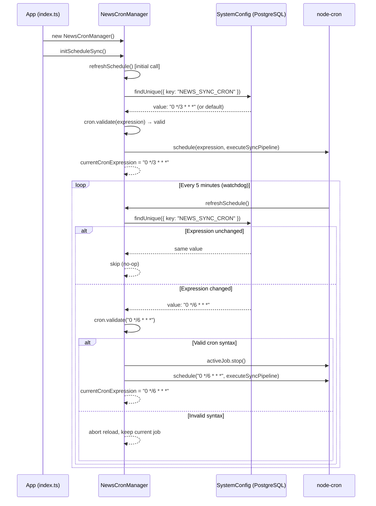
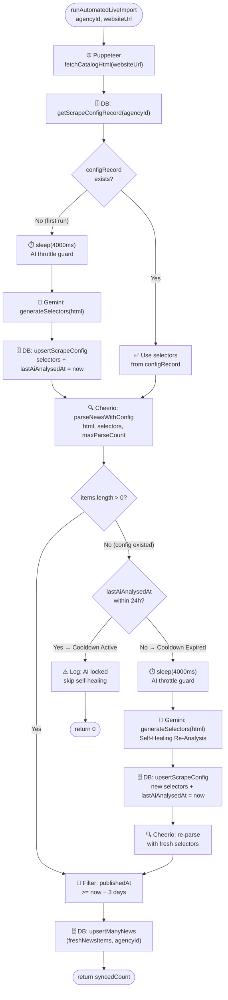

# Architecture Diagrams

Live architectural diagrams of the business processes for the `state-authorities` project.
These diagrams render natively on GitHub thanks to Mermaid.js support.

---

## Diagram 1: Cron Hot-Reload Configuration Process

Describes the 5-minute watchdog cycle of `NewsCronManager`, which monitors changes to
`SystemConfig.NEWS_SYNC_CRON` in the database and gracefully restarts the `node-cron` task
without restarting the server.

**Related files:**
- [`src/modules/news-aggregator/cron/news-cron.ts`](../apps/api/src/modules/news-aggregator/cron/news-cron.ts)
- [`src/index.ts`](../apps/api/src/index.ts)

---

## Diagram 2: News Collection Pipeline with Self-Healing

Describes the complete lifecycle of `NewsImportService.runAutomatedLiveImport()`: from Puppeteer scraping
to saving news items in the database, including self-healing logic powered by Gemini and a 24-hour
cooldown guard to limit AI API requests.

**Related files:**
- [`src/modules/news-aggregator/services/news-import-service.ts`](../apps/api/src/modules/news-aggregator/services/news-import-service.ts)
- [`src/modules/news-aggregator/services/news-ai-analyzer-service.ts`](../apps/api/src/modules/news-aggregator/services/news-ai-analyzer-service.ts)
- [`src/modules/news-aggregator/services/news-scraper-service.ts`](../apps/api/src/modules/news-aggregator/services/news-scraper-service.ts)
- [`src/modules/news-aggregator/services/news-data-service.ts`](../apps/api/src/modules/news-aggregator/services/news-data-service.ts)

### Self-Healing: Key Logic

| State | Behavior |
|---|---|
| No `configRecord` in the DB | First run: AI generates selectors, saves them with `lastAiAnalysedAt = now` |
| `configRecord` exists, `items > 0` | Standard parsing, AI is not called |
| `configRecord` exists, `items == 0`, cooldown is active (`< 24h`) | Self-healing is locked, returns `0` |
| `configRecord` exists, `items == 0`, cooldown expired (`>= 24h`) | AI re-analyzes HTML, updates selectors, parses again |