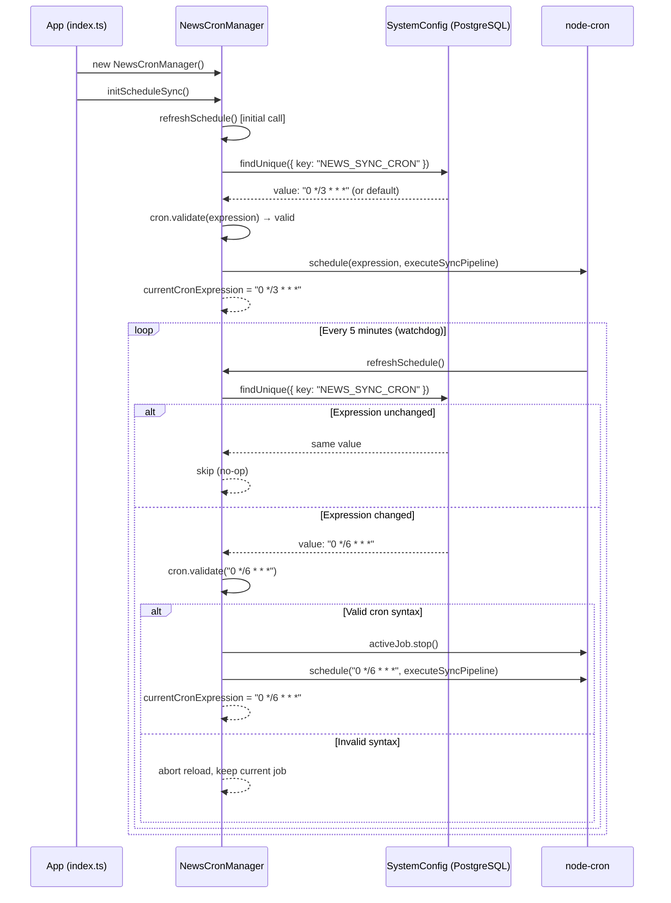

# Architecture Diagrams

Живі архітектурні діаграми бізнес-процесів проєкту `state-authorities`.
Рендеряться нативно у GitHub завдяки підтримці Mermaid.js.

---

## Diagram 1: Cron Hot-Reload Configuration Process

Описує 5-хвилинний watchdog-цикл `NewsCronManager`, який слідкує за змінами
`SystemConfig.NEWS_SYNC_CRON` у БД та м'яко перезапускає `node-cron`-задачу
без перезавантаження сервера.

**Пов'язані файли:**
- [`src/modules/news-aggregator/cron/news-cron.ts`](../apps/api/src/modules/news-aggregator/cron/news-cron.ts)
- [`src/index.ts`](../apps/api/src/index.ts)

---

## Diagram 2: News Collection Pipeline with Self-Healing

Описує повний цикл `NewsImportService.runAutomatedLiveImport()`: від Puppeteer-скрапінгу
до збереження новин у БД, включаючи логіку самолікування через Gemini та 24-годинний
cooldown guard для обмеження звернень до AI API.

**Пов'язані файли:**
- [`src/modules/news-aggregator/services/news-import-service.ts`](../apps/api/src/modules/news-aggregator/services/news-import-service.ts)
- [`src/modules/news-aggregator/services/news-ai-analyzer-service.ts`](../apps/api/src/modules/news-aggregator/services/news-ai-analyzer-service.ts)
- [`src/modules/news-aggregator/services/news-scraper-service.ts`](../apps/api/src/modules/news-aggregator/services/news-scraper-service.ts)
- [`src/modules/news-aggregator/services/news-data-service.ts`](../apps/api/src/modules/news-aggregator/services/news-data-service.ts)

### Self-Healing: ключова логіка

| Стан | Поведінка |
|---|---|
| Немає `configRecord` у БД | Перший запуск: AI генерує селектори, зберігає з `lastAiAnalysedAt = now` |
| `configRecord` є, `items > 0` | Штатний парсинг, AI не викликається |
| `configRecord` є, `items == 0`, cooldown активний (`< 24h`) | Self-healing заблоковано, повертає `0` |
| `configRecord` є, `items == 0`, cooldown минув (`>= 24h`) | AI re-аналізує HTML, оновлює селектори, повторний парсинг |